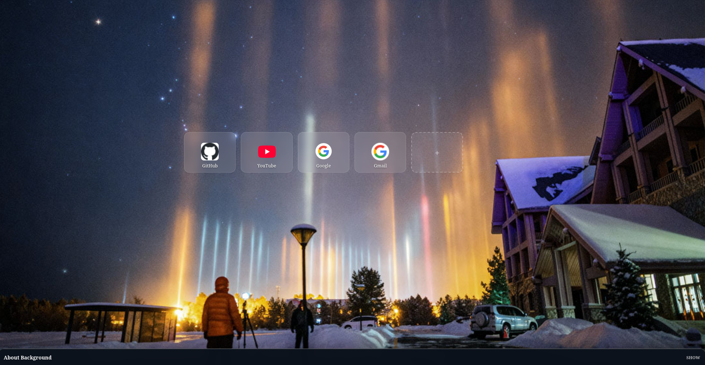
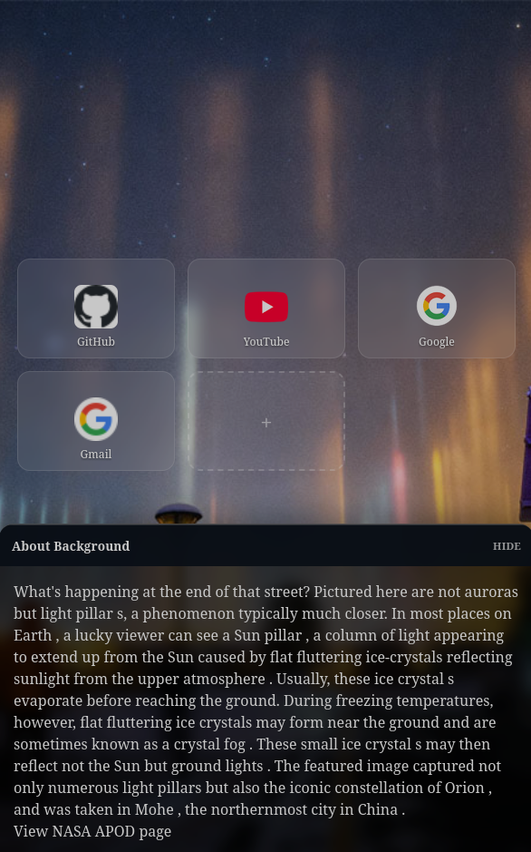
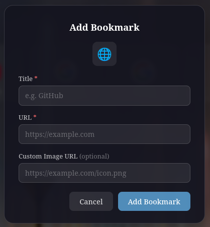

# Custom New Tab

Custom New Tab is an Angular-based browser start page focused on quick access bookmarks and a dynamic NASA APOD background. It is designed to feel like a lightweight dashboard: a centered, reorderable shortcuts grid on top of a full-screen background image, plus an expandable bottom sheet with details about the current background.

## Features

- Reorderable bookmark grid with drag-and-drop
- Add, edit, and delete bookmarks
- Responsive layout that fits more bookmarks on larger screens
- Same-tab bookmark navigation
- Daily NASA APOD background image
- Expandable "About Background" footer sheet
- Local bookmark caching for quick reloads
- PWA/service worker support for offline usage and cached assets
- Mock API server for local development

## Screenshots

### Desktop



### Mobile



### Add Bookmark



## Tech Stack

- Angular 21
- Angular CDK drag-and-drop
- Angular service worker
- RxJS
- Tailwind CSS
- Node mock server for local API responses

## Project Structure

Key parts of the app:

- `apps/web/src/app/bookmarks-grid/` - responsive bookmark grid and drag/drop behavior
- `apps/web/src/app/bookmark-card/` - individual bookmark tile
- `apps/web/src/app/bookmark-edit-modal/` - add/edit bookmark dialog
- `apps/web/src/app/services/bookmark.service.ts` - bookmark state, API sync, and local cache
- `apps/web/src/app/services/bg-service.ts` - APOD background fetch/cache/apply logic
- `apps/web/src/app/core-parts/footer/` - expandable background details sheet
- `services/mock-server/server.js` - local API endpoints for bookmarks and APOD (dev only)
- `services/apod-proxy/server.js` - dedicated APOD proxy service scaffold
- `ngsw-config.json` - offline caching configuration

## Getting Started

### Prerequisites

- Node.js
- npm

### Install dependencies

```bash
npm install
```

## Running Locally

This app expects both the Angular dev server and the local mock API server.

### 1. Start the mock API server

```bash
npm run mock:start
```

The mock server runs on `http://localhost:3000`.

### 2. Start the Angular app

```bash
npm start
```

The app runs on `http://localhost:4200`.

## Available Scripts

### `npm start`

Runs the Angular development server.

### `npm run mock:start`

Runs the local mock server that provides:

- `GET /api/bookmarks`
- `POST /api/bookmarks`
- `PUT /api/bookmarks/:id`
- `DELETE /api/bookmarks/:id`
- `PUT /api/bookmarks/reorder`
- `GET /api/apod`

### `npm run build`

Creates a production build in `dist/CustomNewTab`.

### `npm run watch`

Runs Angular build watch mode.

### `npm test`

Runs the test suite.

## Offline / PWA Behavior

The app includes service worker support so the shell and key cached data remain available offline.

What is cached:

- Application shell assets
- Bookmark API responses
- APOD API responses
- Favicon requests

The bookmark layer also uses local storage so the grid can render quickly before API responses return.

To test the PWA behavior:

```bash
npm run build
```

Then serve the production build from the generated output directory using a static server of your choice.

Example:

```bash
npx serve dist/CustomNewTab/browser
```

After that, open the app in a browser and use DevTools to simulate offline mode.

## Bookmark Behavior

Bookmarks support the following actions:

- Open a site in the current tab
- Drag to reorder
- Edit title, URL, and optional custom image URL
- Delete existing entries
- Add new entries

If no custom image is supplied, the app falls back to a favicon based on the bookmark URL.

## Background Behavior

The page background comes from NASA APOD data returned by the mock server.

The background details sheet shows:

- Explanation text
- Link to the APOD page when available

## Notes for Development

- The APOD background is cached in browser storage
- Bookmark data is cached locally and synced with the API layer
- The footer is implemented as a bottom sheet across screen sizes
- Production builds enable service worker updates

## Future Documentation Placeholders

Placeholder: Browser extension packaging instructions

Placeholder: Deployment instructions

Placeholder: Screenshot asset locations once added to the repo
