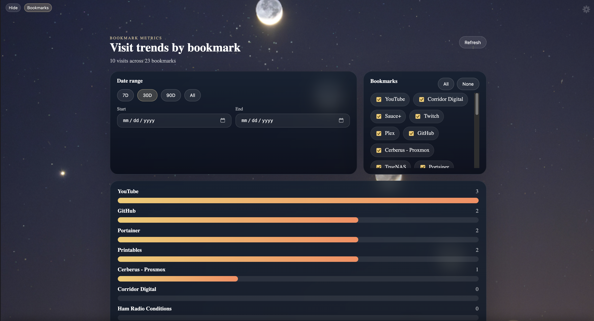

# Custom New Tab

A self-hosted new tab page with bookmarks and a NASA Astronomy Picture Of the Day background. Runs as a Chrome extension, Firefox extension, or a LAN-hosted web app for devices that do not support extensions.


## How it works

The frontend is a single Angular app shared across all three deployment targets. On first launch, a setup screen collects the URLs of your two backend services:

| Service | Purpose | Default port |
|----|----|----|
| **PocketBase** | Bookmark storage and sync | `8090` |
| **APOD proxy** | Fetches the NASA Astronomy Picture of the Day | `3001` |

Bookmarks are cached locally in `localStorage` and synced to PocketBase. Failed writes are queued and replayed when the connection is restored. The APOD background is cached for the current day so it only fetches once per day.


## Features

* Reorderable bookmark grid with drag-and-drop
* Add, edit, and delete bookmarks
* Bookmark visit tracking with a dedicated Stats view
* Responsive layout (2–6 columns depending on screen width)
* Daily NASA APOD full-screen background
* Expandable "About Background" footer sheet with explanation text
* Local-first caching: grid renders instantly from `localStorage`, syncs to backend in the background
* Offline mutation queue: writes made offline are replayed automatically on reconnect
* First-run setup flow to configure backend URLs
* In-app settings to update URLs when hosts change
* PWA / service worker for app-shell caching (LAN-hosted target)
* Chrome extension, Firefox extension, and LAN-hosted web app build targets


## Screenshots

<table>
  <tr>
    <td align="center"><b>Desktop View</b></td>
    <td align="center"><b>Stats View</b></td>
    
  </tr>
  <tr>
    <td></td>
    <td></td>
  </tr>
  <tr>
    <td align="center"><b>Add Bookmark</b></td>
    <td align="center"><b>Mobile View</b></td>
  </tr>
  <tr>
    <td></td>
    <td></td>
  </tr>
</table>


## Development

**Requirements:** Node.js 20+, npm 11+

```bash
# Install dependencies
npm install

# Start the mock server (replaces both PocketBase and the APOD proxy)
npm run mock:start

# In a second terminal, start the Angular dev server
npm start
```

Open `http://localhost:4200`. On first run the setup screen appears — enter `http://localhost:3000` for both service URLs and click **Save & Continue**.

The mock server is a standalone local development tool only. It is not part of Docker Compose.

The mock server provides two groups of routes. The PocketBase-compatible routes are the ones the Angular app actually uses; the legacy routes are kept for backwards compatibility.

**Bookmarks (PocketBase-compatible)**

| Method | Path | Description |
|--------|------|-------------|
| `GET` | `/api/collections/bookmarks/records` | List bookmarks (sorted by `order`, PocketBase list envelope) |
| `POST` | `/api/collections/bookmarks/records` | Create bookmark |
| `PATCH` | `/api/collections/bookmarks/records/:id` | Update bookmark fields |
| `DELETE` | `/api/collections/bookmarks/records/:id` | Delete bookmark |

**Bookmark visits (PocketBase-compatible)**

| Method | Path | Description |
|--------|------|-------------|
| `GET` | `/api/collections/bookmark_visits/records` | List all recorded visits (sorted newest first) |
| `POST` | `/api/collections/bookmark_visits/records` | Record a bookmark visit — accepts `bookmarkId`, `bookmarkTitle`, `bookmarkUrl`, `source`, `context`, `platform`, `userAgent`; returns the created record with auto-generated `id`, `created`, and `updated` fields |

**Utility**

| Method | Path | Description |
|--------|------|-------------|
| `GET` | `/health` | Liveness check — returns `{ status: "ok" }` |
| `GET` | `/api/apod` | Static APOD response (no outbound network requests) |
| `POST` | `/api/test` | Returns the static JSON at `services/mock-server/JSONs/test.json` |


## Production / LAN deployment

**Requirements:** Docker and Docker Compose

```bash
# 1. Copy the example env file and adjust values
cp .env.example .env

# 2. Start the stack and build directly from GitHub
docker compose up -d --build
```

This starts one stack with three services:

* **web** — nginx serving the built Angular app (port `$WEB_PORT`, default `80`)
* **pocketbase** — bookmark persistence (port `$POCKETBASE_PORT`, default `8090`)
* **apod-proxy** — live APOD image fetcher (port `$APOD_PROXY_PORT`, default `3001`)

The `web`, `pocketbase`, and `apod-proxy` images are built by Docker directly from the GitHub repository configured in `.env`:

* `GIT_OWNER_REPO` — GitHub `owner/repo`
* `GIT_REF` — branch, tag, or commit ref to build
* `POCKETBASE_VERSION` — official PocketBase release version downloaded during the image build

Open `http://<your-server-ip>` in a browser. The setup screen asks for the two service URLs.

Recommended (single-origin via nginx reverse proxy):

* **Bookmark service:** `http://<your-server-ip>/pb`
* **APOD service:** `http://<your-server-ip>/apod`

Direct service URLs are also supported if needed:

* **Bookmark service:** `http://<your-server-ip>:8090`
* **APOD service:** `http://<your-server-ip>:3001`

The configuration is stored in `localStorage` per device — complete setup once per browser.

### Optional HTTPS

Add to your `.env` and restart:

```env
ENABLE_TLS=true
TLS_CERTS_DIR=/path/to/certs
```

The cert directory must contain `cert.pem` and `key.pem`.

The nginx container mounts the cert directory read-only, redirects HTTP → HTTPS, and terminates TLS at port `$WEB_TLS_PORT` (default `443`). If the cert/key files are missing or empty, the container automatically falls back to HTTP.

When HTTPS is enabled, prefer single-origin setup values:

* **Bookmark service:** `https://<your-server-ip>/pb`
* **APOD service:** `https://<your-server-ip>/apod`


## Chrome extension

```bash
npm run build:chrome
```

Output: `dist/CustomNewTab/browser/`


1. Open `chrome://extensions`
2. Enable **Developer mode**
3. Click **Load unpacked** → select `dist/CustomNewTab/browser/`


## Firefox extension

```bash
npm run build:firefox
cd dist/CustomNewTab/browser && zip -r ../firefox-extension.xpi . && cd ../../../
```

Output:

`dist/CustomNewTab/browser/ `

and

`dist/CustomNewTab/firefox-extension.xpi` (unsigned)

**Temporary load (testing):**


1. Open `about:debugging#/runtime/this-firefox`
2. Click **Load Temporary Add-on…** → select `dist/CustomNewTab/browser/manifest.json`

**Permanent install:** Zip the output folder and submit to [addons.mozilla.org](https://addons.mozilla.org). Update the `gecko.id` in `apps/web/extension/firefox/manifest.json` to a unique identifier before submitting.


## PocketBase collection schema

Both collections are created automatically via committed JS migrations in `services/pocketbase/pb_migrations/`. When the PocketBase container starts for the first time it applies all pending migrations, so no manual steps are required. The migrations are also idempotent — restarting an existing container will not recreate collections that already exist.

> PocketBase admin UI: `http://<your-server>:8090/_/`

### `bookmarks`

Stores the bookmarks displayed on the new tab page.

| Field | Type | Required |
|----|----|----|
| `title` | Text | ✓ |
| `url` | URL | ✓ |
| `order` | Number | ✓ |
| `customImageUrl` | URL | — |

### `bookmark_visits`

Records each bookmark click for use in the Stats view. Created automatically by the migration in `services/pocketbase/pb_migrations/`.

| Field | Type | Required | Notes |
|----|----|----|----|
| `bookmarkId` | Text | ✓ | ID of the bookmark that was clicked |
| `bookmarkTitle` | Text | ✓ | Title at the time of the click |
| `bookmarkUrl` | URL | ✓ | URL at the time of the click |
| `source` | Text | ✓ | `web`, `chrome-extension`, or `firefox-extension` |
| `context` | Text | — | Where in the UI the click originated |
| `platform` | Text | — | `navigator.platform` value from the browser |
| `userAgent` | Text | — | `navigator.userAgent` value from the browser |
| `created` | DateTime | auto | Set by PocketBase on record creation; used for date-range filtering |

The Stats view aggregates visit counts from this collection client-side. API rules for both collections should allow read/write without authentication unless you have configured token-based access control.


## Environment variables

| Variable | Default | Description |
|----|----|----|
| `GIT_OWNER_REPO` | `StarVore/custom-new-tab` | GitHub repository used as the Docker build source |
| `GIT_REF` | `main` | Branch, tag, or commit ref to build from |
| `POCKETBASE_VERSION` | `0.36.7` | PocketBase release version downloaded in the image build |
| `WEB_PORT` | `80` | Host port for the web service (HTTP) |
| `WEB_TLS_PORT` | `443` | Host port for the web service (HTTPS) |
| `POCKETBASE_PORT` | `8090` | Host port for PocketBase |
| `APOD_PROXY_PORT` | `3001` | Host port for the APOD proxy |
| `PUID` | `1000` | UID for PocketBase volume writes |
| `PGID` | `1000` | GID for PocketBase volume writes |
| `TZ` | `UTC` | Timezone |
| `ENABLE_TLS` | `false` | Set `true` to enable HTTPS for the web/nginx service |
| `TLS_CERTS_DIR` | `./certs` | Host directory containing `cert.pem` and `key.pem` |
| `APOD_ENABLE_TLS` | `false` | Set `true` to enable HTTPS directly on the APOD service |


## Troubleshooting

**Setup screen reappears on every visit**
Backend URLs are stored in `localStorage` per browser. Each browser or device must complete setup once.

**"Could not connect" on the test button**

* Verify the service is running: `docker compose ps`
* Check the port is reachable from your device (firewall, VPN, or subnet)
* If the frontend is served over HTTPS but backend URLs are HTTP, the browser may block mixed-content requests — serve everything over HTTPS or keep both over HTTP

**CORS errors in the browser console**
Both the mock server and APOD proxy return `Access-Control-Allow-Origin: *`. CORS errors usually mean the request is reaching the wrong host or port — double-check the URLs in Settings (⚙ icon on the home screen).

**Bookmarks not syncing after reconnect**
Failed writes are queued in `localStorage` under `bookmark_pending_mutations` and replayed when the browser fires the `online` event. To inspect or clear the queue manually, use DevTools → Application → Local Storage.

**TLS enabled but the site still serves HTTP**

* Confirm `ENABLE_TLS=true` in `.env`
* Confirm cert and key files are non-empty at the configured paths
* Recreate the container: `docker compose up -d --build --force-recreate web`

**Stale APOD background**
The background is cached for the current day under `apod_background` in `localStorage`. To force a refresh: `localStorage.removeItem('apod_background')` in the browser console, then reload.

**APOD proxy returns no image**
The proxy walks back up to 5 days when the current day is a video. If it still fails, check network access from the proxy container to `apod.nasa.gov`.

**Docker build is not using the version I expect**

* Check `GIT_OWNER_REPO` and `GIT_REF` in `.env`
* Rebuild explicitly: `docker compose build --no-cache`
* Pin `GIT_REF` to a tag or commit if you need reproducible deployments


